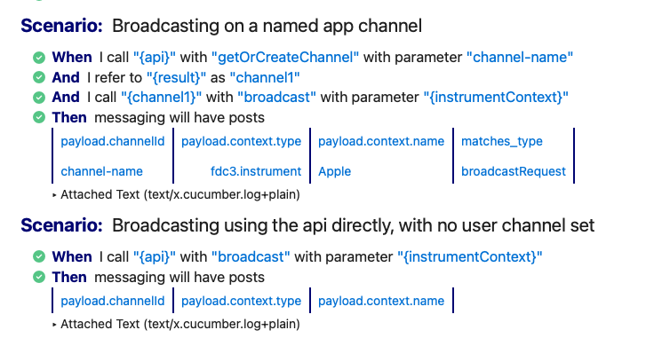
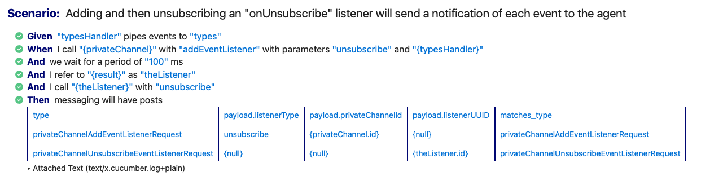
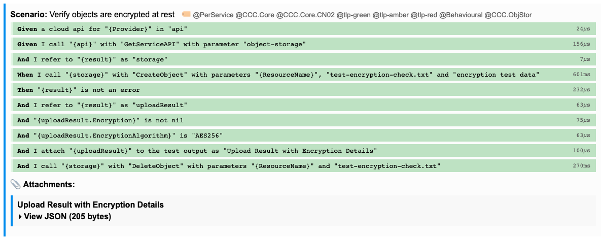

# Standard Cucumber Steps

TLDR: Reusable Cucumber step definitions for TypeScript, Java, Go, and C# — a single canonical DSL for BDD testing across languages.  An excellent fit for hands-off, agentic code development.

## What this is

The downside of BDD / Cucumber is having to maintain the step code - code that links step text (Given... When... Then...) to executable code in the tests themselves.

Standard Cucumber Steps (SCS) is a library of pre-built Cucumber step definitions, available for TypeScript, Java, Go, and C#. Instead of writing `Given`, `When`, and `Then` glue code yourself, you import SCS and immediately get a rich vocabulary for calling functions, inspecting results, and asserting on data — all driven by a shared scenario language.

## Why this is useful

Cucumber is a good fit for some testing problems and a poor fit for others. Before reaching for it, it is worth understanding the trade-offs:

| | | |
|---|---|---|
| Pro | **Readable by non-engineers** | Scenarios written in plain English can be reviewed and authored by product managers, QA analysts, and domain experts without reading code |
| Pro | **Living documentation** | Feature files stay in sync with the implementation by definition — if a scenario fails, the documentation is wrong |
| Pro | **Language-agnostic contracts** | The same `.feature` file can drive tests in TypeScript, Java, Go, and C# simultaneously, making it ideal for cross-language SDKs and generated code |
| Pro | **Encourages separation of concerns** | The glue layer (step definitions) is forced to stay thin; business logic cannot hide inside tests |
| Pro | **Reporting is excellent** | Step definitions pass and fail cleanly and you can see exactly how far a test has got without debugging it |
| Con | **Higher maintenance overhead** | Each scenario needs corresponding step definitions; large test suites can become hard to manage without discipline. This usually puts developers off using Cucumber as you feel you are writing everything twice. |

SCS addresses the maintenance cost directly: writing step definitions is repetitive boilerplate that every project reimplements. SCS does it once, correctly, across four languages.

This is especially valuable when:

- **Testing a cross-language API or SDK** — write the scenarios once, run them in each language's test suite to verify consistent behaviour.
- **Migrating between languages** — the same feature files document the expected contract before, during, and after a migration.
- **Adopting BDD on an existing codebase** — wire up your service with a few lines in a `@Before` hook and the step library covers the rest.
- **Writing tests for generated code** — code generators that target multiple languages can share a single golden test suite.
- **Working with agentic AI coding** - Feature files are an unusually clear form of instruction both for an AI coding agent and a human reviewer.   See [BDD and SCS for AI agentic coding](docs/agentic-coding.md) for a full discussion.

---

## Quick example

Let's say you have this interface (TypeScript):

```typescript
interface BankAccount {

  deposit(amt: number)

  getBalance(): number

}
```

We can write this feature file to test the implementation:

```gherkin
Scenario: Depositing money increases the balance
  Given "account" is set up as a bank account with balance "0"
  When I call "{account}" with "deposit" using argument "100"
  And I call "{account}" with "deposit" using argument "50"
  And I call "{account}" with "getBalance"
  Then "{result}" is "150"
```

The `Given` step is the only language-specific glue you need to write — it puts your object into the shared `props` store. Every other step comes from SCS.

See the [tutorial](docs/tutorial.md) for a full walkthrough.

## Quick Start

### TypeScript

```bash
npm install @robmoffat/standard-cucumber-steps
```

```typescript
import { setupGenericSteps, PropsWorld } from '@robmoffat/standard-cucumber-steps';

setWorldConstructor(PropsWorld);
setupGenericSteps();
```

### Java (Maven)

```xml
<dependency>
  <groupId>io.github.robmoffat</groupId>
  <artifactId>standard-cucumber-steps</artifactId>
  <version>0.1.0</version>
</dependency>
```

### Go

```bash
go get github.com/robmoffat/standard-cucumber-steps/go
```

```go
import generic "github.com/robmoffat/standard-cucumber-steps/go"

world := generic.NewPropsWorld()
world.RegisterSteps(ctx)
```

### C# (NuGet)

```bash
dotnet add package StandardCucumberSteps
```

---

## See it in action

The same feature files run across all supported languages, producing consistent test results:

### TypeScript



### Java



### Go



---

## Step Reference

Full documentation with examples for each step group:

- [Variables](docs/variables.md) — storing and referencing props, boolean/null/numeric literals
- [Assertions](docs/assertions.md) — equality, contains, numeric comparisons, error assertions
- [Method Calls](docs/method-calls.md) — calling functions and object methods
- [Async Steps](docs/async.md) — async functions and background jobs
- [Array Assertions](docs/array-assertions.md) — matching arrays and objects against data tables
- [Test Setup](docs/test-setup.md) — invocation counters, async functions, delays

### [Variables](docs/variables.md)

| Step | Description |
|------|-------------|
| `Given "key" is "value"` | Store a string (or resolved literal) in props |
| `Then "{key}" is "value"` | Assert prop equals value |
| `When I refer to "{from}" as "to"` | Alias (copy) one prop to another |
| `{varName}` | Prop lookup in any step argument |
| `{null}` `{true}` `{false}` `{42}` | Literal values |

### [Assertions](docs/assertions.md)

| Step | Description |
|------|-------------|
| `Then "{x}" is "value"` | String equality |
| `Then "{x}" is null` | Assert null/nil |
| `Then "{x}" is not null` | Assert not null |
| `Then "{x}" is true` | Assert truthy |
| `Then "{x}" is false` | Assert falsy |
| `Then "{x}" is undefined` | Assert undefined/nil |
| `Then "{x}" is empty` | Assert empty array or string |
| `Then "{x}" is an error` | Assert is an error/exception |
| `Then "{x}" is an error with message "msg"` | Assert error message |
| `Then "{x}" is not an error` | Assert not an error |
| `Then "{x}" contains "substring"` | Assert string contains |
| `Then "{x}" is a string containing one of` | Assert contains one of *(+DataTable)* |
| `Then "{x}" should be greater than "y"` | Numeric greater-than |
| `Then "{x}" should be less than "y"` | Numeric less-than |

### [Method Calls](docs/method-calls.md)

| Step | Description |
|------|-------------|
| `When I call "{fn}"` | Call a no-arg function |
| `When I call "{fn}" using argument "{p1}"` | Call with one argument |
| `When I call "{fn}" using arguments "{p1}" and "{p2}"` | Call with two arguments |
| `When I call "{fn}" using arguments "{p1}", "{p2}", and "{p3}"` | Call with three arguments |
| `When I call "{fn}" using arguments "{p1}", "{p2}", "{p3}", and "{p4}"` | Call with four arguments |
| `When I call "{obj}" with "{method}"` | Call a method on an object |
| `When I call "{obj}" with "{method}" using argument "{p1}"` | Call method with one argument |
| `When I call "{obj}" with "{method}" using arguments "{p1}" and "{p2}"` | Call method with two arguments |
| `When I call "{obj}" with "{method}" using arguments "{p1}", "{p2}", and "{p3}"` | Call method with three arguments |
| `When I call "{obj}" with "{method}" using arguments "{p1}", "{p2}", "{p3}", and "{p4}"` | Call method with four arguments |

### [Async Steps](docs/async.md)

| Step | Description |
|------|-------------|
| `When I wait for "{fn}"` | Call and await in one step |
| `When I wait for "{fn}" within "{ms}" ms` | Call and await with timeout |
| `When I wait for "{fn}" using argument "{p1}"` | Call with arg and await |
| `When I wait for "{fn}" using arguments "{p1}" and "{p2}"` | Call with two args and await |
| `When I wait for "{fn}" using arguments "{p1}", "{p2}", and "{p3}"` | Call with three args and await |
| `When I wait for "{fn}" using arguments "{p1}", "{p2}", "{p3}", and "{p4}"` | Call with four args and await |
| `When I start "{fn}" as "jobName"` | Start async job in background |
| `When I start "{fn}" using argument "{p1}" as "jobName"` | Start job with one arg |
| `When I start "{fn}" using arguments "{p1}" and "{p2}" as "jobName"` | Start job with two args |
| `When I start "{fn}" using arguments "{p1}", "{p2}", and "{p3}" as "jobName"` | Start job with three args |
| `When I start "{fn}" using arguments "{p1}", "{p2}", "{p3}", and "{p4}" as "jobName"` | Start job with four args |
| `When I wait for job "jobName"` | Wait for named job (30s timeout) |
| `When I wait for job "jobName" within "{ms}" ms` | Wait with custom timeout |

### [Array Assertions](docs/array-assertions.md)

| Step | Description |
|------|-------------|
| `Then "{x}" is an array of objects with the following contents` | Exact ordered match *(+DataTable)* |
| `Then "{x}" is an array of objects with at least the following contents` | Subset match *(+DataTable)* |
| `Then "{x}" is an array of objects which doesn't contain any of` | Negative match *(+DataTable)* |
| `Then "{x}" is an array of objects with length "{n}"` | Length assertion |
| `Then "{x}" is an array of strings with the following values` | String array match *(+DataTable)* |
| `Then "{x}" is an object with the following contents` | Single object field match *(+DataTable)* |

### [Test Setup](docs/test-setup.md)

| Step | Description |
|------|-------------|
| `Given "handler" is a invocation counter into "count"` | Create a counting callable |
| `Given "fn" is an async function returning "{value}"` | Create an async function |
| `Given "fn" is an async function returning "{value}" after "{ms}" ms` | Create an async function with delay |
| `Given we wait for a period of "{ms}" ms` | Sleep/delay |

---

## Shared Feature Files

The `features/` directory contains `.feature` files that exercise every canonical step. Each language implementation points its test runner at this shared directory, so the same scenarios validate all four implementations.

---

## Used by

SCS was extracted from three [FINOS](https://www.finos.org/) open-source projects.  Factoring it out into a shared library means each project gets consistent behaviour.

| Project | Language | Description |
|---------|----------|-------------|
| [FDC3](https://github.com/finos/FDC3) | TypeScript | The FDC3 desktop interoperability standard; SCS drives its conformance test suite |
| [FDC3-java-api](https://github.com/finos/fdc3-java-api) | Java | Java implementation of the FDC3 API; uses SCS to verify the Java bindings against the same feature files |
| [ccc-cfi-compliance](https://github.com/finos-labs/ccc-cfi-compliance) | Go | FINOS Common Cloud Controls compliance testing; uses SCS as the generic step layer for cross-language contract verification |

Each of these projects wires up its own domain objects in a single `@Before` hook and then delegates all step execution to SCS.

## License

Apache 2.0
