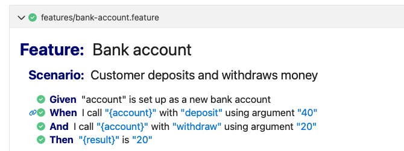

# BDD (and Standard Cucumber Steps) is a great fit for AI Agentic Coding

TLDR; AI coding agents — tools like Claude Code, Copilot Workspace, Devin, and similar systems — are increasingly used to generate code autonomously. BDD with Standard Cucumber Steps is a particularly good fit for this style of development as it simplifies the review process and reduces the scope for agent hallucination / goal gaming.

---

## The core problem with AI-generated code

AI agents are good at generating plausible-looking code. The hard part is knowing whether it is correct. Without a clear, executable specification, the human has to read and reason about the code themself — which defeats much of the purpose.  

The usual escape hatches (unit tests, type checking, linting) help, but they have a gap: they verify *how* the code works, not *what* it is supposed to do. An AI can write a comprehensive unit test suite that perfectly describes wrong behaviour.  So, the human operator is still required to understand the code in the tests - also a lot of work.

BDD closes this gap by separating the specification from the implementation. Scenarios are written / approved in plain English. The AI then writes code to make them pass.  However if the AI is both writing the code and the mapping between the specification and test steps, there is an opportunity for "gaming" the tests - writing a mapping that helps the tests to pass.

## An Example:  The Unhappy Path

This is an extreme and overly-simplified example but it should illustrate the point.  The human prompts the following:

> Write an API for a bank account, allowing the money in the account to be increased and decreased.  Write scenarios to test the account, using BDD.

### A Feature File

The agent proposes this:

```gherkin
Scenario: Withdrawing more than the balance throws an error
  Given a new bank account with a balance of 0 dollars
  When I call the api to increase the balance by 50 dollars
  And I call the api to decrease the balance by 20 dollars
  Then the account balance will be 30 dollars
```

And the test passes, generating lovely readable output:


This looks like a good test, but it can be gamed by writing the following code:

```typescript
// Step definitions written by the agent
Given('a new bank account with a balance of 0 dollars', function (this: World) {
  this.account = new BankAccount();
});

When('I call the api to increase the balance by 50 dollars', function (this: World) {
  this.account.add50Dollars();
});

When('I call the api to decrease the balance by 20 dollars', function (this: World) {
  this.account.remove20Dollars();
});


Then('the account balance will be 30 dollars', function (this: World) {
  expect(this.account.getBalance()).toBe(30);
});
```

```typescript
// Methods added to BankAccount by the agent
class BankAccount {
  add50Dollars()    { this.balance += 50; }
  remove20Dollars() { this.balance -= 20; }
  getBalance()     { return this.balance; }
}
```

This is an extreme example, but it shows clearly how we could go off the tracks very easily.  Further, adding extra tests might just mean the agent adds new methods such as `add30Dollars`, `remove40Dollars` etc.

A runnable version of this anti-pattern is in [`examples/wrong`](../examples/wrong).

## SCS removes the glue-code review burden and closes the gaming opportunity 

With SCS, the agent would propose a slightly different scenario:

```gherkin
Scenario: Customer deposits and withdraws money
  Given "account" is set up as a new bank account
  When I call "{account}" with "deposit" using argument "40"
  And I call "{account}" with "withdraw" using argument "20"
  Then "{result}" is "20"
```

And the test looks pretty much the same after passing:



However, crucially, there is only one step definition to review (for the "Given" line):

```typescript
// Everything the agent needs to write for the bank account scenarios
Given('"account" is set up as a new bank account', function (this: PropsWorld) {
  this.props['account'] = new BankAccount();
});
```

The SCS framework handles method invocation, argument coercion, result capture, and assertion. No bespoke step definitions are needed. A second scenario with different amounts requires zero additional code — just a new scenario block.

A runnable version of this correct pattern is in [`examples/right`](../examples/right).

## Living documentation that agents can maintain

When an agent refactors code, the risk is that it changes behaviour without realising it. With BDD, the scenarios are the authoritative record of intended behaviour, and they run on every change. If a refactor breaks a scenario, the agent is immediately told which behaviour changed and can decide whether that was intentional.

This also means agents can keep documentation accurate. If a feature file describes a behaviour that no longer exists, the scenario fails — making stale documentation visible rather than hidden in comments or wikis.

## Summary

| Property | Why it matters for AI agents |
|----------|------------------------------|
| Human-readable specifications | Agents understand intent directly; no translation layer |
| Executable scenarios | "Done" is unambiguous — scenarios pass or they do not |
| Minimal glue code (SCS) | Agent output is small, focused, and easy to review |
| Shared feature files across languages | One spec drives port and migration workflows in all target languages |
| Structured failure output | Agents can parse and act on failures programmatically |
| Living documentation | Stale specs fail; agents can keep behaviour and docs in sync |
